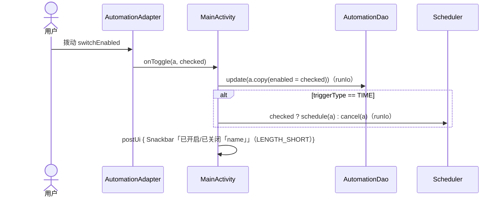
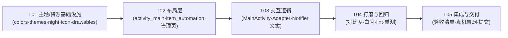

# QuickLaunch UI 升级 + 遗留优化 —— 增量架构设计与任务分解

- 版本：v1.0
- 架构师：高见远（software-architect）
- 基线：git HEAD = 7307b8f（P0-P2 稳定性加固已提交）
- 范围：**只做 UI 现代化 + 交互优化 + 文案优化**，不改业务逻辑（Scheduler / HolidaySync / RootUtils / ScreenOnOverlay / KeepAliveService 排程与保活链路全部不动）
- 本设计输出文件：
  - `docs/system_design.md`（本文档）
  - `docs/class-diagram.mermaid`
  - `docs/sequence-diagram.mermaid`

---

## Part A：系统设计

### 1. 实现方案

#### 1.1 核心难点分析

| 难点 | 风险点 | 对策 |
|---|---|---|
| M3 完整色板 + 深色跟随系统 | 色值零散（现只有 5 个裸色）、无 values-night，暗色下文字/卡片会糊成一片 | 一次性补齐完整 M3 token 色板，`values-night` 同名色值覆盖；主题只引用 `@color/m3_*`，切换零代码 |
| 深色切换白闪 | 未设 `android:windowBackground`，冷启动/切换瞬间窗口为默认白底 | 主题显式 `android:windowBackground=@color/m3_background`（night 感知）+ `android:forceDarkAllowed=false` 防系统强暗二次叠加 |
| 列表项状态一眼可辨 | 现卡片只有文字 + Switch，无状态视觉锚点 | 卡片重排：状态色点（启用绿/停用灰）+ 名称 + 描述 + 开关 + 删除按钮分层 |
| 删除误触 | 现 onDelete 直接删库，无确认 | MaterialAlertDialog 二次确认 + 删除后 Snackbar 撤销（重插原 id，保留 PendingIntent requestCode，重排程） |
| 操作区挤占列表空间 | 4 个操作行裸堆在顶部，规则一多列表被压缩 | 操作区整体收纳进一张 MaterialCardView，卡片固定高度，列表从卡片下方开始 |
| minSdk 24 兼容 | Material 3 部分组件/属性在旧 API 上需要兜底 | 全部使用 material 1.12 已兼容 API（MaterialCardView/MaterialAlertDialog/SwitchCompat/Snackbar/TextButton 均 minSdk 21+ 可用）；状态色点用普通 View + drawable 背景（非 attr 填充，规避旧 API drawable attr 兼容坑） |
| 无障碍对比度 | 现存 `#666666`、`#2980b9` 硬编码色在暗色下不达标 | 全部替换为 `?attr/colorOnSurfaceVariant` / `@color/m3_tertiary`（两种模式均 ≥ 4.5:1），删除按钮保证 48dp 触达高度 |

#### 1.2 技术选型

- **不新增任何第三方依赖**：material 1.12.0 已含 MaterialCardView、MaterialAlertDialogBuilder、SwitchCompat、Snackbar、TextButton、MaterialButton，全部满足需求。
- **不使用 Dynamic Color / 不引入 navigation / 不引入图片加载库**（P2 明确关闭）。
- 架构维持现有「Activity + ViewBinding + 单例 Util」轻量结构，**不引入 MVVM 状态管理**——规则数量个位数，现有 runIo/postUi 线程模型已经过稳定性加固验证，本次只在其上叠加 UI 交互。

#### 1.3 架构模式

保持现有分层，仅做两处职责内聚：

```
UI 层（本次改动）
  MainActivity：标题/操作区/空状态 + 删除确认 + 撤销 Snackbar + 开关反馈 + 同步 loading
  AutomationAdapter：卡片绑定（状态点/省略号/开关防复用）
  LaunchService.Notifier：门禁/兜底通知文案（仅文案）
资源层（本次改动）
  values/ + values-night/：完整 M3 色板 + 主题
  layout/：主界面分区卡片化、item 卡片重排、管理页硬编码色清理
  drawable|mipmap：自适应图标、状态点、空状态图标
业务层（不动）
  data/（Room）、util/Scheduler、util/HolidaySync、util/RootUtils、service/KeepAliveService、receiver/* 等保持原样
```

---

### 2. M3 主题色板设计（具体色值）

品牌种子色沿用现有 `#3DDC84`（Android 绿）。光模式主色取深绿保证对比度（5.6:1），品牌亮绿作为 primaryContainer 保留视觉血缘；暗模式主色即品牌亮绿家族。

#### 2.1 光模式（`values/colors.xml`）

| Token 名 | 色值 | 说明/对比度 |
|---|---|---|
| m3_primary | `#2E7D32` | 品牌绿深调；对白字 5.6:1 ✅ |
| m3_on_primary | `#FFFFFF` | |
| m3_primary_container | `#A8EDA5` | 品牌亮绿家族，卡片/图标容器 |
| m3_on_primary_container | `#002105` | |
| m3_secondary | `#52634D` | |
| m3_on_secondary | `#FFFFFF` | |
| m3_secondary_container | `#D5E8CB` | |
| m3_on_secondary_container | `#121F0E` | |
| m3_tertiary | `#38656B` | 数据源 tag 等点缀 |
| m3_on_tertiary | `#FFFFFF` | |
| m3_tertiary_container | `#BCE8EE` | |
| m3_on_tertiary_container | `#001F24` | |
| m3_error | `#BA1A1A` | |
| m3_on_error | `#FFFFFF` | |
| m3_error_container | `#FFDAD6` | |
| m3_on_error_container | `#410002` | |
| m3_background | `#F9FAF3` | 暖白背景；windowBackground 用此色防白闪 |
| m3_on_background | `#191D17` | |
| m3_surface | `#F9FAF3` | |
| m3_on_surface | `#191D17` | |
| m3_surface_variant | `#DFE5D8` | |
| m3_on_surface_variant | `#43483E` | 次要文字；对背景 ≈7:1 ✅（替代 #666666） |
| m3_outline | `#73796C` | |
| m3_outline_variant | `#C3C9BC` | |
| m3_surface_container_lowest | `#FFFFFF` | |
| m3_surface_container_low | `#F3F5EC` | |
| m3_surface_container | `#EDF1E6` | 操作区卡片底色 |
| m3_surface_container_high | `#E7EBE1` | |
| m3_surface_container_highest | `#E1E6DB` | |
| m3_inverse_surface | `#2E322B` | |
| m3_inverse_on_surface | `#F0F4EA` | |
| m3_inverse_primary | `#8BD58C` | |
| status_enabled | `#2E7D32` | 启用状态点 |
| status_disabled | `#8D938A` | 停用状态点（灰） |
| ic_launcher_bg | `#1B7A3D` | 图标背景（深绿，与主题 primary 同族） |
| 旧名兼容（保留，勿删） | green/green_dark/white/black/text_hint | 供 T02 完成前编译过渡；T04 清理后仅 ic_launcher 兜底可能引用 |

#### 2.2 暗模式（`values-night/colors.xml`，同名覆盖）

| Token 名 | 色值 |
|---|---|
| m3_primary | `#8BD58C` |
| m3_on_primary | `#00390A` |
| m3_primary_container | `#17541F` |
| m3_on_primary_container | `#A8EDA5` |
| m3_secondary | `#BBCBB0` |
| m3_on_secondary | `#263524` |
| m3_secondary_container | `#3C4B38` |
| m3_on_secondary_container | `#D5E8CB` |
| m3_tertiary | `#9CCDD3` |
| m3_on_tertiary | `#00363D` |
| m3_tertiary_container | `#204D53` |
| m3_on_tertiary_container | `#BCE8EE` |
| m3_error | `#FFB4AB` |
| m3_on_error | `#690005` |
| m3_error_container | `#93000A` |
| m3_on_error_container | `#FFDAD6` |
| m3_background | `#11140F` |
| m3_on_background | `#E1E5DC` |
| m3_surface | `#11140F` |
| m3_on_surface | `#E1E5DC` |
| m3_surface_variant | `#43483E` |
| m3_on_surface_variant | `#C3C9BC` |
| m3_outline | `#8D9386` |
| m3_outline_variant | `#43483E` |
| m3_surface_container_lowest | `#0C0F0A` |
| m3_surface_container_low | `#191C17` |
| m3_surface_container | `#1D211B` |
| m3_surface_container_high | `#272B25` |
| m3_surface_container_highest | `#32362F` |
| m3_inverse_surface | `#E1E5DC` |
| m3_inverse_on_surface | `#2E322B` |
| m3_inverse_primary | `#2E7D32` |
| status_enabled | `#8BD58C` |
| status_disabled | `#7E857A` |

#### 2.3 主题（`values/themes.xml` 重写 + `values-night/themes.xml` 结构覆盖）

`Theme.QuickLaunch` 保留 parent `Theme.Material3.DayNight.NoActionBar`，把上表所有 `m3_*` 逐一映射到 M3 属性（colorPrimary/colorOnPrimary/colorPrimaryContainer/colorOnPrimaryContainer/colorSecondary/colorOnSecondary/colorSecondaryContainer/colorOnSecondaryContainer/colorTertiary/colorOnTertiary/colorTertiaryContainer/colorOnTertiaryContainer/colorError/colorOnError/colorErrorContainer/colorOnErrorContainer/android:colorBackground/colorOnBackground/colorSurface/colorOnSurface/colorSurfaceVariant/colorOnSurfaceVariant/colorOutline/colorOutlineVariant/colorSurfaceContainerLowest/Low/Container/High/Highest/colorInverseSurface/colorInverseOnSurface/colorInversePrimary），并显式加：

```xml
<item name="android:windowBackground">@color/m3_background</item>  <!-- 防白闪关键 -->
<item name="android:forceDarkAllowed">false</item>                  <!-- 防系统强暗二次叠加 -->
```

`Theme.QuickLaunch.Transparent` 同步把 `android:colorPrimary` 改为 `@color/m3_primary`，其余透明属性不动。

`values-night/themes.xml`：提供同名 `Theme.QuickLaunch`（parent 相同），仅承载结构覆盖（当前无必须项，保持 `forceDarkAllowed=false` 兜底 + 注释说明「色值差异全部走 values-night/colors.xml 同名覆盖，此处不重复」）。**约定：深色差异一律写在 colors-night 里，不在 night 主题里堆色值。**

---

### 3. 文件清单（新增/修改，含改动要点）

| # | 相对路径 | 操作 | 改动要点 |
|---|---|---|---|
| 1 | `app/src/main/res/values/colors.xml` | 重写 | 新增全部 `m3_*` 光模式 + `status_enabled/status_disabled` + `ic_launcher_bg`；**保留旧名 green/green_dark/white/black/text_hint** 供过渡期编译 |
| 2 | `app/src/main/res/values-night/colors.xml` | 新增 | 全部 `m3_*` + `status_*` 暗模式同名覆盖 |
| 3 | `app/src/main/res/values/themes.xml` | 重写 | 完整 M3 属性映射 + windowBackground + forceDarkAllowed=false；Transparent 同步 |
| 4 | `app/src/main/res/values-night/themes.xml` | 新增 | 同名主题结构覆盖（见 2.3） |
| 5 | `app/src/main/res/drawable/ic_launcher.xml` | 改色 | 保留闪电 path；底色改 `@color/ic_launcher_bg`、闪电 `#FFFFFF`（作为 24-25 兜底图标） |
| 6 | `app/src/main/res/mipmap-anydpi-v26/ic_launcher.xml` | 新增 | 自适应图标：`background=@color/ic_launcher_bg` + `foreground=@drawable/ic_launcher_foreground` |
| 7 | `app/src/main/res/mipmap-anydpi-v26/ic_launcher_round.xml` | 新增 | 同 6（round 版） |
| 8 | `app/src/main/res/drawable/ic_launcher_foreground.xml` | 新增 | 闪电 vector，限制在 108dp 安全区（中心 66dp 内），白/浅绿双色 |
| 9 | `app/src/main/res/drawable/status_dot_on.xml` | 新增 | `<shape oval><solid android:color="@color/status_enabled"/></shape>`，8dp 圆点 |
| 10 | `app/src/main/res/drawable/status_dot_off.xml` | 新增 | 同上，`@color/status_disabled` |
| 11 | `app/src/main/res/drawable/ic_empty_state.xml` | 新增 | 空状态图标（vector 轮廓，如闪电/闹钟 outline），ImageView 用 `app:tint="?attr/colorOnSurfaceVariant"` 上色 |
| 12 | `app/src/main/AndroidManifest.xml` | 修改 | `android:icon="@mipmap/ic_launcher"`、`android:roundIcon="@mipmap/ic_launcher_round"` |
| 13 | `app/src/main/res/layout/activity_main.xml` | 重写结构 | 见 3.1 |
| 14 | `app/src/main/res/layout/item_automation.xml` | 重写结构 | 见 3.2 |
| 15 | `app/src/main/res/layout/item_holiday.xml` | 修改 | 删除按钮改 `Widget.Material3.Button.TextButton`；`#666666` → `?attr/colorOnSurfaceVariant` |
| 16 | `app/src/main/res/layout/item_source.xml` | 修改 | `#666666` → `?attr/colorOnSurfaceVariant`；`#2980b9` → `?attr/colorTertiary` |
| 17 | `app/src/main/res/layout/activity_holiday_manage.xml` | 修改 | tvHint/tvEmpty 硬编码色 → 主题色 |
| 18 | `app/src/main/res/layout/activity_source_manage.xml` | 修改 | tvHint 硬编码色 → 主题色 |
| 19 | `app/src/main/java/com/workbuddy/quicklaunch/MainActivity.kt` | 修改 | 见 3.3 |
| 20 | `app/src/main/java/com/workbuddy/quicklaunch/AutomationAdapter.kt` | 修改 | 见 3.4 |
| 21 | `app/src/main/java/com/workbuddy/quicklaunch/service/LaunchService.kt` | 修改 | Notifier 文案微调（仅文案，不动逻辑） |
| 22 | `docs/UI_ACCEPTANCE.md` | 新增 | 验收清单（T05 交付物） |

> `activity_create.xml`、`KeepAliveService.kt`、`receiver/*`、`util/*`、`data/*`：**不改**（主题生效后 M3 样式自动覆盖表单控件）。

#### 3.1 activity_main.xml 分区重排

```
ConstraintLayout (root, 保持)
├─ tvTitle：升级为「标题栏」——surfaceContainer 底色容器 + headlineSmall 字号 + 加粗，
│   视觉与 M3 对齐（保留 id tvTitle，避免动代码）
├─ MaterialCardView @id/cardOperations（新增，cardCornerRadius=16dp, elevation=1dp, margin=16/8dp）
│   └─ LinearLayout vertical
│       ├─ layoutAntiSleep（保留 id，行内 tvAntiSleep + swAntiSleep SwitchCompat）
│       ├─ View divider（1dp, ?attr/colorOutlineVariant）
│       ├─ layoutSource（保留 id，行内「数据源」+ spinnerSource）
│       ├─ btnSyncHolidays（保留 id，改 MaterialButton 全宽，文案“同步法定节假日”）
│       └─ layoutHolidayActions（保留 id，两按钮行 btnManageHolidays / btnManageSources）
├─ RecyclerView @id/recycler：top 改挂 cardOperations 底部；clipToPadding=false
│   padding 顶部 4dp 底部 88dp（给 FAB 让位）；itemAnimator 用默认 DefaultItemAnimator（不写）
├─ tvEmpty：改造为 LinearLayout vertical（居中）
│   ├─ ImageView @id/ivEmptyIcon（ic_empty_state, 64dp, tint ?attr/colorOnSurfaceVariant）
│   └─ TextView @id/tvEmptyText（“还没有自动化规则”，15sp, ?attr/colorOnSurfaceVariant）
│   约束：top→cardOperations 底 / bottom→parent 底，与 recycler 同区域叠放（visible 互斥）
└─ fabAdd（保留，M3 主题自动换色）
```

#### 3.2 item_automation.xml 卡片重排（信息层级）

```
MaterialCardView（保留：margin 6dp, corner 12dp, elevation 2dp, ?attr/colorSurfaceContainerLow 底）
└─ LinearLayout vertical padding 14dp
    ├─ LinearLayout horizontal（顶行，center_vertical）
    │   ├─ View @id/vStatusDot（8dp x 8dp，背景由 Adapter 设 status_dot_on/off）—— 状态色点
    │   ├─ TextView @id/tvName（weight=1, marginStart 10dp, 16sp bold, maxLines=1, ellipsize=end）
    │   └─ SwitchCompat @id/switchEnabled（M3 主题色）
    ├─ TextView @id/tvDesc（marginTop 6dp, 13sp, ?attr/colorOnSurfaceVariant, maxLines=2, ellipsize=end）
    └─ Button @id/btnDelete（TextButton 风格, 右下, minHeight 48dp, 文案“删除”）
```

#### 3.3 MainActivity.kt 改动要点

```kotlin
// 新增：删除二次确认
private fun onDelete(a: Automation) {
    MaterialAlertDialogBuilder(this)
        .setTitle("删除自动化？")
        .setMessage("「${a.name}」将被删除，其定时任务会一并取消。")
        .setPositiveButton("删除") { _, _ -> performDelete(a) }
        .setNegativeButton("取消", null)
        .show()
}

// 新增：真正删除 + 撤销
private fun performDelete(a: Automation) {
    val app = applicationContext
    runIo {
        if (a.triggerType == TriggerType.TIME) Scheduler.cancel(app, a)
        runCatching { db.automationDao().delete(a) }
        val items = runCatching { db.automationDao().getAll() }.getOrDefault(emptyList())
        postUi {
            adapter.submit(items)
            binding.tvEmpty.visibility = if (items.isEmpty()) View.VISIBLE else View.GONE
            Snackbar.make(binding.root, "已删除「${a.name}」", Snackbar.LENGTH_LONG)
                .setAction("撤销") { undoDelete(a) }   // 闭包持有原 Automation（含原 id）
                .show()
        }
    }
}

// 新增：撤销 = 重插原 id + 若 TIME 且 enabled 则重新排程
private fun undoDelete(a: Automation) {
    val app = applicationContext
    runIo {
        runCatching { db.automationDao().insert(a) }   // 显式带原 id，PendingIntent requestCode 不变
        if (a.triggerType == TriggerType.TIME && a.enabled) Scheduler.schedule(app, a)
        val items = runCatching { db.automationDao().getAll() }.getOrDefault(emptyList())
        postUi {
            adapter.submit(items)
            binding.tvEmpty.visibility = if (items.isEmpty()) View.VISIBLE else View.GONE
        }
    }
}

// 修改：开关切换加反馈（在现有 runIo 成功回包后）
// postUi { Snackbar.make(binding.root, if (checked) "已开启「${a.name}」" else "已关闭「${a.name}」", Snackbar.LENGTH_SHORT).show() }

// 修改：同步按钮 loading 态（现有 isEnabled 基础上加文案）
// syncHolidays(): binding.btnSyncHolidays.text = "同步中…"; 回调里恢复 "同步法定节假日"
// 修改：同步失败文案更友好：
// "节假日数据同步失败（已保留上次数据），定时规则不受影响，可稍后重试"
```

#### 3.4 AutomationAdapter.kt 改动要点

```kotlin
// onBindViewHolder 中新增：
holder.b.vStatusDot.setBackgroundResource(if (a.enabled) R.drawable.status_dot_on else R.drawable.status_dot_off)

// 长文案省略号（布局层已配 maxLines/ellipsize，代码无需改；若需动态可 setEllipsize）
// Switch 防复用逻辑（先摘监听→赋值→挂监听）保持不变
// submit = notifyDataSetChanged 保持不变（规则量个位数，DiffUtil 不划算）
```

---

### 4. 数据结构与接口（新增部分）

无新数据表、无新 Entity。仅新增以下轻量 UI 接口：

```kotlin
// 状态点映射（不需要独立文件，Adapter 内联即可，接口如下）
// AutomationAdapter
fun statusDotRes(enabled: Boolean): Int =
    if (enabled) R.drawable.status_dot_on else R.drawable.status_dot_off

// 删除撤销载体：直接复用 Automation 对象（闭包捕获），不需要额外 class。
// 关键不变量：undoDelete 用原 id 重插 → Room @PrimaryKey(autoGenerate=true) 显式带 id 会保留该 id，
// Scheduler.pendingIntent 的 requestCode = a.id.toInt() 因此与删除前一致，AlarmManager 不会出现重复闹钟。

// 同步结果回调（沿用现有 HolidaySync.Result），仅改展示文案：
// HolidaySync.Result(success, sourceLabel, count)
```

类图（Mermaid 见 `docs/class-diagram.mermaid`，摘要）：

```mermaid
classDiagram
    class Automation {
        +Long id
        +String name
        +String targetPackage
        +String targetAppName
        +String triggerType
        +Int timeHour
        +Int timeMinute
        +String repeatMode
        +Int repeatDays
        +Boolean skipHolidays
        +String bluetoothName
        +Boolean enabled
        +Long createdAt
        +Boolean randomWindow
        +Int windowStartMin
        +Int windowEndMin
    }
    class AutomationAdapter {
        -List~Automation~ items
        -onToggle: (Automation, Boolean) -> Unit
        -onDelete: (Automation) -> Unit
        +submit(list: List~Automation~)
        +onBindViewHolder(holder: VH, position: Int)
        -statusDotRes(enabled: Boolean): Int
        -triggerLabel(a: Automation): String
    }
    class MainActivity {
        -adapter: AutomationAdapter
        -db: AppDatabase
        -io: ExecutorService
        +onCreate(savedInstanceState: Bundle?)
        +onResume()
        -refresh()
        -onToggle(a: Automation, checked: Boolean)
        -onDelete(a: Automation)
        -performDelete(a: Automation)
        -undoDelete(a: Automation)
        -syncHolidays()
        -applyInsets()
    }
    class AutomationDao {
        <<interface>>
        +getAll(): List~Automation~
        +insert(a: Automation): Long
        +update(a: Automation)
        +delete(a: Automation)
    }
    class Scheduler {
        <<object>>
        +schedule(context: Context, a: Automation, holidays: HolidayChecker?)
        +cancel(context: Context, a: Automation)
        +rescheduleAll(context: Context)
    }
    MainActivity --> AutomationAdapter : 构造注入回调
    AutomationAdapter ..> Automation : 绑定/展示
    MainActivity --> AutomationDao : 增删改查
    MainActivity --> Scheduler : 排程/取消（仅 TIME）
    AutomationAdapter ..> "R.drawable.status_dot_on/off" : 状态点
    MainActivity ..> "Snackbar + MaterialAlertDialogBuilder" : 交互反馈
```

---

### 5. 程序调用流程（时序）

完整 Mermaid 见 `docs/sequence-diagram.mermaid`，关键两条如下。

#### 5.1 删除流程（确认 → 删库 → 撤销 → 重插+重排程）

```mermaid
sequenceDiagram
    actor U as 用户
    participant AD as AutomationAdapter
    participant MA as MainActivity
    participant SCH as Scheduler
    participant DAO as AutomationDao

    U->>AD: 点击卡片 btnDelete(a)
    AD->>MA: onDelete(a)
    MA->>MA: MaterialAlertDialogBuilder 二次确认
    U->>MA: 点「删除」
    MA->>MA: performDelete(a)
    MA->>SCH: cancel(a)（仅 TIME，runIo）
    MA->>DAO: delete(a)（runIo）
    MA->>MA: postUi { adapter.submit(新列表); tvEmpty 联动 }
    MA->>MA: Snackbar「已删除「name」」+ 撤销 action（LENGTH_LONG）
    alt 用户点「撤销」
        U->>MA: setAction 回调 undoDelete(a)
        MA->>DAO: insert(a)（显式原 id，runIo）
        MA->>SCH: schedule(a)（TIME && enabled，runIo）
        MA->>MA: postUi { adapter.submit(新列表) }
    else 用户不操作 / Snackbar 超时
        Note over MA: 删除保持，流程结束
    end
```

竞态说明：
- **撤销后再点删除**：undoDelete 重插后列表刷新，用户再次点删除走完整「确认 → 删除」链路，与首次删除完全正交，无状态残留。
- **连续删除多条**：Snackbar 在同一个 binding.root 上排队展示，第二条的撤销 action 只作用于第二条，闭包各自捕获各自的 Automation。
- **撤销时 Activity 已销毁**：postUi 已有 `isFinishing/isDestroyed` 丢弃保护；闭包捕获的是 applicationContext 与 db（AppDatabase.get 单例），不会泄漏 Activity。

#### 5.2 开关切换流程



---

### 6. 待明确事项（已收敛，自洽假设）

| # | 事项 | 设计假设（不阻塞实现） |
|---|---|---|
| 1 | 品牌绿主色选取 | 光模式主色取深绿 `#2E7D32`（保证 4.5:1 对比度），品牌亮绿 `#3DDC84` 家族下沉为 primaryContainer/暗色主色；若后续要更贴近原亮绿可微调 seed，本次按此执行 |
| 2 | 撤销窗口时长 | 采用 Snackbar LENGTH_LONG（约 4s），不再自研倒计时 |
| 3 | 图标适配 | 采用自适应图标（API 26+），24-25 用更新配色后的原 vector 兜底；不引入 mipmap 位图 |
| 4 | 状态色点语义 | 仅以「启用=绿 / 停用=灰」表达，与 Switch 状态联动；不新增第三种状态（如“将触发”） |
| 5 | Dynamic Color / 手动深色 | 本次明确关闭（P2），不引入依赖、不留入口 |
| 6 | 外屏门禁提示 | 仅优化**文案**（同步失败 Snackbar、LaunchService 通知文案），不改 LaunchProxyActivity/DisplayPicker 拦截逻辑（属业务层，超出 UI 范围） |

---

## Part B：任务分解

### 7. 所需依赖

**无新增依赖。** 现有依赖已全部覆盖本次需求：

```
com.google.android.material:material:1.12.0   （已有：MaterialCardView / MaterialAlertDialogBuilder / SwitchCompat / Snackbar / TextButton / MaterialButton）
androidx.appcompat:appcompat:1.7.0            （已有：AppCompatActivity / AlertDialog 兼容）
androidx.recyclerview:recyclerview:1.3.2      （已有：默认 DefaultItemAnimator）
```

> 不引入 Dynamic Color（`dynamiccolor`）、图片加载库、navigation。

---

### 8. 任务列表（按依赖顺序，粒度可执行）

> 任务总数 5（硬性上限内）。T01 为项目基础设施；T02/T03 实现主体；T04/T05 为打磨与集成验证。
> 颜色资源先行（T01）是因为所有 layout 与主题都引用 `@color/m3_*`；布局先行（T02）是因为 T03 的 Kotlin 代码依赖 ViewBinding 生成的新 id。

#### T01 项目基础设施：M3 主题色板 + 深色模式 + 图标 + 新资源（P0）

| 项 | 内容 |
|---|---|
| 文件 | `app/src/main/res/values/colors.xml`（重写）、`app/src/main/res/values-night/colors.xml`（新增）、`app/src/main/res/values/themes.xml`（重写）、`app/src/main/res/values-night/themes.xml`（新增）、`app/src/main/res/drawable/ic_launcher.xml`（改色）、`app/src/main/res/mipmap-anydpi-v26/ic_launcher.xml`（新增）、`app/src/main/res/mipmap-anydpi-v26/ic_launcher_round.xml`（新增）、`app/src/main/res/drawable/ic_launcher_foreground.xml`（新增）、`app/src/main/res/drawable/status_dot_on.xml`（新增）、`app/src/main/res/drawable/status_dot_off.xml`（新增）、`app/src/main/res/drawable/ic_empty_state.xml`（新增）、`app/src/main/AndroidManifest.xml`（icon 改 mipmap） |
| 改动要点 | ① colors.xml 写入 2.1 全部 m3_* 光模式 + 保留旧名；② values-night 写入 2.2 同名暗模式；③ themes.xml 完整 M3 属性映射 + windowBackground + forceDarkAllowed=false；④ 自适应图标 + 前景闪电 + 背景色；⑤ manifest 指向新 mipmap |
| 验收点 | `./gradlew assembleDebug` 通过；切系统深色后冷启动/返回无白闪（windowBackground 生效）；桌面图标为深绿底白闪电；无 `@color/green` 直接引用残留导致编译错误（旧名已保留兜底） |

#### T02 布局层：主界面分区卡片化 + 列表卡片重排 + 管理页硬编码色清理（P0）

| 项 | 内容 |
|---|---|
| 文件 | `app/src/main/res/layout/activity_main.xml`（重写结构）、`app/src/main/res/layout/item_automation.xml`（重写结构）、`app/src/main/res/layout/item_holiday.xml`（修改）、`app/src/main/res/layout/item_source.xml`（修改）、`app/src/main/res/layout/activity_holiday_manage.xml`（修改）、`app/src/main/res/layout/activity_source_manage.xml`（修改） |
| 改动要点 | ① activity_main 按 3.1 分区：cardOperations 收纳 4 个操作行、tvTitle 升级、tvEmpty 加图标、recycler 挂到卡片下；② item_automation 按 3.2 重排（状态点+名称+开关顶行、描述次行、删除右下）；③ 所有 `#666666`→`?attr/colorOnSurfaceVariant`、`#2980b9`→`?attr/colorTertiary`；④ 管理页按钮改 M3 TextButton 风格 |
| 依赖 | T01 |
| 验收点 | 主界面操作区为一张圆角卡片且不挤占列表；列表项状态点可见、长文案省略号生效；深色下管理页文字可读（无 #666 残留）；ViewBinding 编译通过 |

#### T03 交互逻辑：删除确认 + 撤销 + 开关反馈 + loading + 文案（P0/P1）

| 项 | 内容 |
|---|---|
| 文件 | `app/src/main/java/com/workbuddy/quicklaunch/MainActivity.kt`（修改）、`app/src/main/java/com/workbuddy/quicklaunch/AutomationAdapter.kt`（修改）、`app/src/main/java/com/workbuddy/quicklaunch/service/LaunchService.kt`（修改） |
| 改动要点 | ① MainActivity：onDelete 改弹 MaterialAlertDialog；新增 performDelete（后台 cancel+delete+刷新+撤销 Snackbar）；新增 undoDelete（重插原 id + 条件重排程）；onToggle 成功回包后 Snackbar 反馈；syncHolidays 按钮 loading 文案（“同步中…”→恢复）；同步失败文案友好化；② AutomationAdapter：vStatusDot 设置 status_dot_on/off；tvName/tvDesc 省略号（布局已配，代码确认）；Switch 防复用逻辑保留；③ LaunchService.Notifier：通知文案微调（“正在启动 XX · 若未自动打开，点此立即启动”） |
| 依赖 | T02（ViewBinding 新 id） |
| 验收点 | 删除必弹确认框；删除后 Snackbar 点「撤销」规则恢复且 TIME 规则重新排程（logcat 验证 AlarmManager setExact 重新注册）；开关切换有 Snackbar；同步按钮呈 loading；`./gradlew test` 28 用例全绿 |

#### T04 打磨与回归：无障碍对比度 + 无白闪复核 + lint/单测（P1）

| 项 | 内容 |
|---|---|
| 文件 | 全量 grep 涉及：`app/src/main/res/layout/*.xml`（残留硬编码色）、`app/src/main/res/values/themes.xml` + `values-night/themes.xml`（forceDarkAllowed/windowBackground 复核）、`app/src/main/java/com/workbuddy/quicklaunch/MainActivity.kt`（对比度/触达尺寸复核） |
| 改动要点 | ① 全局清除 `#666666`/`#2980b9`/`#3DDC84`/`#2BB673` 硬编码引用，一律换主题色；② 复核次要文字用 colorOnSurfaceVariant（双模式 ≥4.5:1）；③ btnDelete minHeight 48dp；④ RecyclerView 默认 ItemAnimator 确认（不写自定义）；⑤ 深色切换无白闪复核（双模式冷启动截图对比）；⑥ 跑 lint + 全量单测 + assembleRelease |
| 依赖 | T03 |
| 验收点 | `lint` 0 error；28 单测全绿；release 构建成功；对比度抽查达标；双模式截图无白闪 |

#### T05 集成与交付：验收清单 + 真机冒烟 + 提交（P0 收尾）

| 项 | 内容 |
|---|---|
| 文件 | `docs/UI_ACCEPTANCE.md`（新增，验收清单）、`app/src/main/java/com/workbuddy/quicklaunch/MainActivity.kt`（按清单小修）、`app/src/main/java/com/workbuddy/quicklaunch/AutomationAdapter.kt`（按清单小修）、`app/src/main/res/layout/activity_main.xml`（按清单小修） |
| 改动要点 | ① 编写验收清单：深色跟随系统且无白闪、列表状态一眼可辨、删除确认+撤销+撤销后再删竞态、操作区不挤占列表、对比度 4.5:1、外屏冒烟；② Moto Razr 真机/模拟器按清单逐项冒烟；③ 发现的小问题就地修复；④ git commit（信息含 UI 升级说明） |
| 依赖 | T04 |
| 验收点 | 验收清单全过；删除撤销竞态场景（删→撤销→再删）无异常；commit 完成 |

---

### 9. 共享知识 / 约定（Engineer 必读）

1. **颜色命名规范**：主题 token 一律 `m3_<role>`（下划线小写，如 `m3_primary_container`）；状态/图标等业务色用 `status_*`/`ic_*`。**不新增第三个命名体系。**
2. **深色模式约定**：
   - 深色差异**只写 `values-night/colors.xml` 同名覆盖**，不在 night 主题里堆色值；
   - **禁止硬编码颜色**（`#666666`、`#2980b9` 等一律清除），文字用 `?attr/colorOnSurfaceVariant` 或 `@color/m3_on_surface_variant`；
   - 主题必须保留 `android:forceDarkAllowed=false`（防止系统强暗把 M3 深色再叠一遍）与 `android:windowBackground=@color/m3_background`（防白闪）；
   - 不提供手动切换入口（P2 关闭，跟随系统）。
3. **边到边 insets 约定**：所有 Activity 保持 `enableEdgeToEdge()` + 各自现有 applyInsets 消费 systemBars+displayCutout；**不在主题/布局里设置 statusBarColor/navigationBarColor**（targetSdk 35+ 已失效）；MainActivity 的 applyInsets 保持对 root 整体 padding，改动布局后需复核 padding 仍正确。
4. **线程模型**：延续现有 runIo/postUi 模式；删除/撤销/开关的 DB 与 Scheduler 调用一律 `runIo`，UI 更新一律 `postUi`（自带 isFinishing/isDestroyed 保护）。
5. **撤销不变量**：`undoDelete` 必须用**原 Automation 对象（含原 id）** 重插，保证 `Scheduler.pendingIntent` 的 requestCode（`a.id.toInt()`）与删除前一致，避免重复闹钟/漏闹钟。
6. **状态点实现**：用 `vStatusDot.setBackgroundResource(status_dot_on/off)` 而非代码 tint，颜色走 drawable 内 `@color/status_*` 自动随 night 切换，规避旧 API drawable attr 兼容坑。
7. **文案**：中文硬编码是有意选择（lint 已 disable HardcodedText），沿用现有风格；不动业务文案（“跳假”“自定义”等）。
8. **不动的红线**：`Scheduler.kt`、`HolidaySync.kt`、`RootUtils.kt`、`ScreenOnOverlay.kt`、`AntiSleep.kt`、`DisplayPicker.kt`、`KeepAliveService.kt`（排程/保活逻辑）、`data/*`（Room 实体/DAO）、`receiver/*` —— 上一轮加固成果，UI 任务不得触碰。

---

### 10. 任务依赖图



> 说明：T02/T03 依赖链是 ViewBinding 生成顺序决定的（代码引用布局新 id），属必要线性依赖；T04/T05 为验证收尾，可交由工程师与 QA 协作完成。
